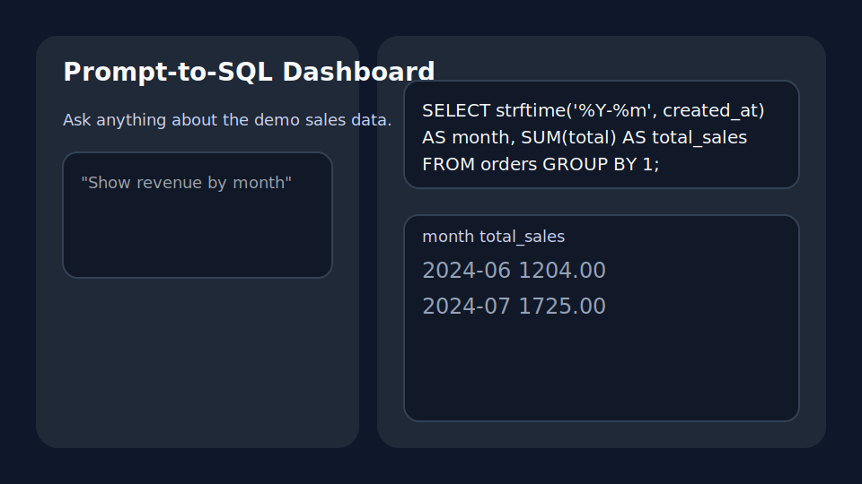

# Prompt-to-SQL Dashboard

Natural language questions become runnable SQL for a demo SQLite sales dataset. The UI shows the generated SQL and live rows, powered by the OpenAI Responses API.



## Why it stands out
- Converts queries like “Show total orders by month” into production-ready SQL using the prompt _"Convert this English query into valid SQL for the following schema..."_
- Executes the SQL against a bundled SQLite dataset (products, orders, order_items) so users immediately see results.
- Ships with a lightweight web UI plus a documented backend for learning/teaching Codex-style workflows.

## File structure
```
prompt-to-sql-dashboard/
├── backend/
│   ├── __init__.py
│   ├── app.py             # FastAPI app + CORS + endpoints
│   ├── models.py          # Pydantic request/response contracts
│   ├── prompts.py         # Prompt template for OpenAI
│   ├── sql_service.py     # OpenAI call + SQLite execution
│   ├── sample_data.py     # Seeds data/sales.db
│   └── requirements.txt   # Backend dependencies
├── data/
│   └── sales.db           # Generated SQLite demo database
├── frontend/
│   ├── index.html         # Static dashboard
│   ├── script.js          # Fetch logic + rendering
│   └── styles.css         # Minimal styling
├── assets/
│   └── mock-dashboard.svg # Mock UI screenshot
└── README.md
```

## Getting started
### 1. Backend API
```bash
cd prompt-to-sql-dashboard
python3 -m venv .venv
source .venv/bin/activate
pip install -r backend/requirements.txt
export OPENAI_API_KEY=sk-your-key
python backend/sample_data.py   # seeds data/sales.db
uvicorn backend.app:app --reload --port 8000
```

### 2. Frontend preview
Serve `frontend/` with any static server (e.g., `python -m http.server --directory frontend 4173`) and visit it while the API runs on `http://127.0.0.1:8000`.

## Example API usage
Request:
```bash
curl -X POST http://127.0.0.1:8000/query \
  -H "Content-Type: application/json" \
  -d '{"natural_language": "Show total revenue by month for web orders"}'
```
Response:
```json
{
  "sql": "SELECT strftime('%Y-%m', created_at) AS month, SUM(total) AS total_revenue FROM orders WHERE channel = 'web' GROUP BY 1",
  "columns": ["month", "total_revenue"],
  "rows": [["2024-06", "726.0"], ["2024-07", "228.0"]],
  "notes": "Results generated from sales.db demo dataset"
}
```

## Demo dataset
- `products`: id, name, category, unit_price
- `orders`: id, customer, channel, total, created_at
- `order_items`: order_id, product_id, quantity, line_total

`backend/sample_data.py` can be edited to add more rows or new tables; rerun the script whenever you change it.

## Future ideas
1. Add schema-aware guards to prevent impossible joins before calling OpenAI.
2. Stream SQL/token usage and show cost estimates in the UI.
3. Support uploading CSVs and auto-ingesting them into SQLite on the fly.
